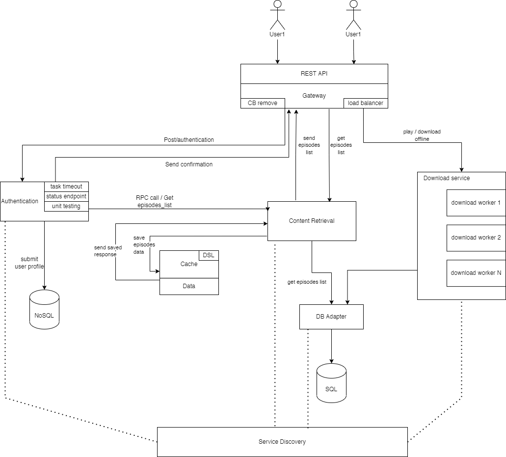

## Task
The task for this laboratory work is to create a distributed backend system for a podcast app.

## Checkpoint #1
### Services/ Features (to be implemented)
* SQL and NoSQL databases;
* Status Endpoint;
* Task Timeouts;
* Service Discovery;
* RPC between services;
* Unit Testing;
* Concurrent tasks limit.

### Gateway features (to be implemented)
* Load Balancing: Round Robin;
* Outbound API - REST;
* Circuit Breaker: Remove service if threshold is reached.

### Cache features (to be implemented)
* Query Language.

### Personal features (to be implemented)
* Authentication;
* Podcast download;
* Content retrieval;
* BD adapter.

### System Architecture Diagram
Diagram showcasing the architecture of the system.

